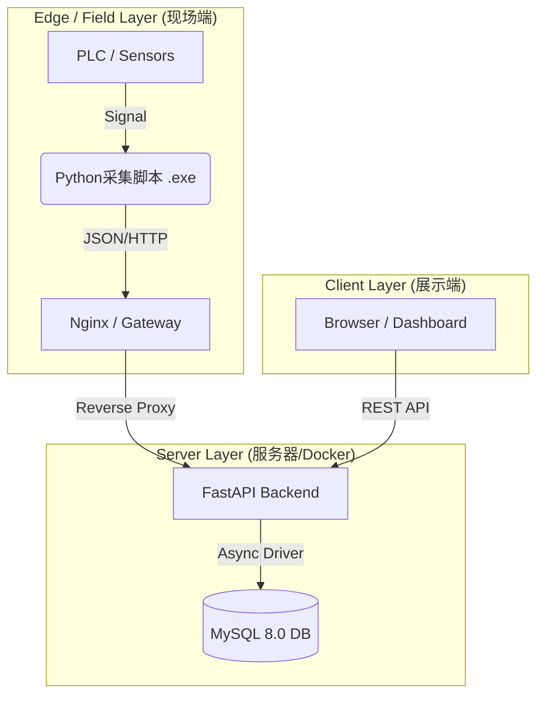

# 🏭 Mini-MES: Next-Gen Industrial IoT Solution

> **轻量级 · 抗脆弱 · 边缘原生** | 面向中小制造企业的现代化生产执行系统。

## 📖 项目背景与愿景 (Vision)

传统 MES 系统庞大、昂贵且僵化，难以适应中小工厂（SME）灵活多变的生产需求。工业现场普遍存在“硬件老化、非结构化数据多、需求变更频繁”的痛点。

**Mini-MES** 并非传统系统的缩水版，而是基于 **Edge-Cloud（端-云）协同架构** 的重构。我们致力于通过现代化技术栈，以极低的边际成本，实现工业现场数据的**全链路采集、可视化与追溯**。

## 🏗️ 核心架构设计 (Architecture & Decisions)

作为从零构建的系统，我们在技术选型上遵循 **"实用主义"** 与 **"适度超前"** 的原则：

### 1. 🛡️ "JSON-Hybrid" 混合存储策略 (Anti-Fragile Data Model)

* **痛点**: 甲方需求极不稳定，今天测“重量”，明天就要测“温度”和“扭矩”。传统关系型数据库（RDBMS）频繁变更 Schema 是灾难。
* **方案**: 采用 MySQL 8.0 的 JSON 特性。
* **Core Fields**: `line_id`, `device_id`, `timestamp` 等核心索引字段保持强类型，确保查询性能。
* **Dynamic Payload**: 业务数据（如 SKU、检测值、环境参数）封装为 JSON 对象存储。


* **价值**: 实现了 **Schema-less** 的灵活性，无需停机即可适应新设备的接入，具备极强的抗需求变更能力。

### 2. ⚡ 全异步高并发链路 (Async I/O)

* **选型**: Python **FastAPI** + **SQLAlchemy (Async)** + **AsyncMy**。
* **思考**: 工业数据采集具有“高频、短报文”的特征。传统的同步阻塞 IO（Django/Flask）在多设备并发上传时容易造成线程阻塞。全异步链路确保了在低配服务器上也能维持极高的吞吐量 (Throughput)。

### 3. 🏭 工业级可视化 (Industrial UX)

* **UI 哲学**: 摒弃花哨动效。采用 **Element Plus** 定制主题，坚持 **"High Contrast / Dark Mode"**（高对比度/深色模式）。
* **场景**: 适应车间强光/弱光环境，降低操作员视觉疲劳，关键指标（OK/NG）一眼可辨。

### 4. 🐳 容器化基础设施 (Infrastructure as Code)

* **部署**: **Docker Compose** 编排。
* **价值**: 彻底解决 "It works on my machine" 问题。实现 Server 端的一键交付，数据库与后端服务版本严格锁定，降低现场实施成本。

## 🛠️ 技术栈矩阵 (Tech Stack)

| 领域 | 核心技术 | 选型理由 |
| --- | --- | --- |
| **Backend** | Python 3.10+, FastAPI | 现代、高性能、类型安全 (Type Hints) |
| **Database** | MySQL 8.0 | 成熟稳定，且具备优秀的 JSON 查询能力 |
| **ORM** | SQLAlchemy (Async) | Python 界 ORM 事实标准，支持异步 |
| **Frontend** | Vue 3, Vite, Pinia | 响应式性能极佳，开发体验极快 |
| **UI Component** | Element Plus | 专业的企业级/后台组件库 |
| **DevOps** | Docker, Docker Compose | 标准化交付与环境隔离 |
| **Protocol** | RESTful HTTP / JSON | 通用性强，易于异构系统集成 |

## 📐 系统拓扑 (Topology)



## 🚀 快速启动 (Quick Start)

### 前置要求

* Docker Desktop (Windows/Mac) 或 Docker Engine (Linux)
* Git

### 部署步骤

1. **克隆仓库**
```bash
git clone https://github.com/YourUsername/Mini-MES.git
cd Mini-MES

```


2. **启动服务 (Docker)**
```bash
# 首次启动会自动构建镜像并初始化数据库
docker-compose up --build -d

```


3. **系统接入**
* **后端 API 文档 (Swagger)**: `http://localhost:8000/docs`
* **前端实时看板**: `http://localhost:5173`


## 📂 项目结构说明

```text
Mini-MES/
├── docs/                   # 📝 架构文档与开发复盘日记
├── src/
│   ├── backend/            # 🧠 后端核心 (FastAPI)
│   │   ├── app/core/       # 数据库连接与配置
│   │   ├── app/models/     # ORM 模型定义
│   │   ├── app/schemas/    # Pydantic 数据校验
│   │   └── app/api/        # 业务路由接口
│   └── frontend/           # 👁️ 前端视图 (Vue3)
├── docker-compose.yml      # 🐳 容器编排文件
└── README.md               # 📄 本文件

```

## 📅 路线图 (Roadmap)

* [x] **v0.1 MVP**: 基础架构搭建，Docker 化，核心数据采集与展示跑通。
* [ ] **v0.2 Edge**: 发布 Python 采集端 SDK/Exe，支持模拟数据生成。
* [ ] **v0.3 Business**: 增加批次管理 (Batch No.)、设备状态监控。
* [ ] **v1.0 Release**: 引入 Redis 缓存层，支持 WebSocket 实时推送。

---

## 👥 维护者 (Maintainers)

### Run-Haji
**Project Lead & System Architect**
负责 Mini-MES 的**顶层架构设计**、**技术栈选型**以及**核心业务逻辑抽象**。

### Gemini (AI Model)
**Technical Copilot**
协助开发者完成了从**数据库建模**、**后端高并发链路实现**到**前端组件化开发**的全流程落地，极大地缩短了系统的研发周期（Time-to-Market）。

> **Copyright**: © 2026 Mini-MES Open Source Project.

---

