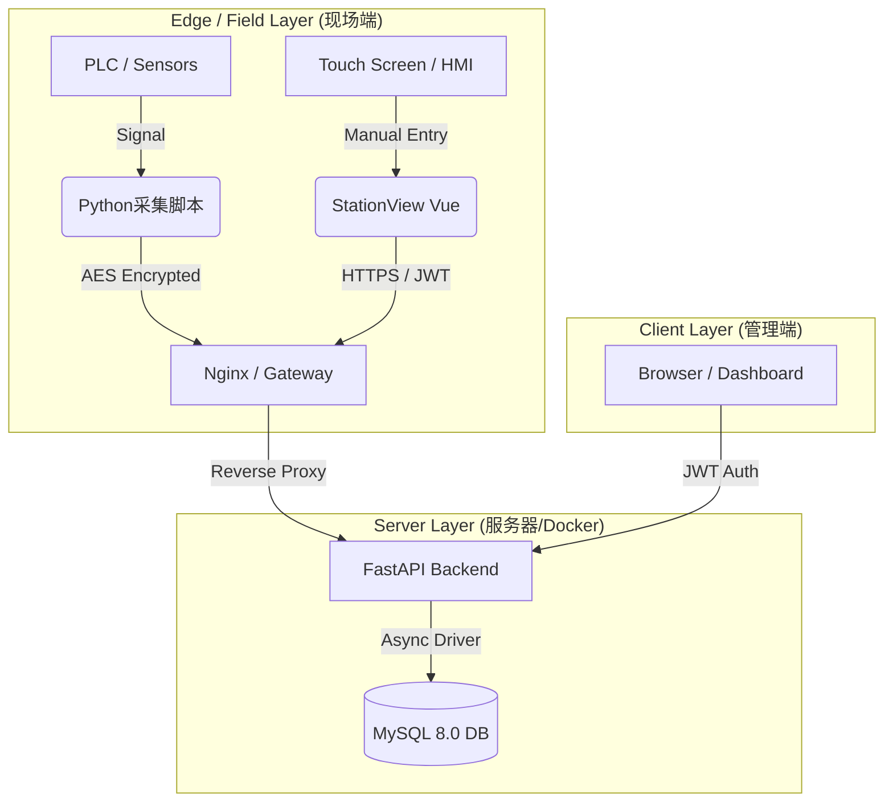

# 🏭 Mini-MES: Next-Gen Industrial IoT Solution

> **轻量级 · 抗脆弱 · 边缘原生** | 面向中小制造企业的现代化生产执行系统。

## 📖 项目背景与愿景 (Vision)

传统 MES 系统庞大、昂贵且僵化，难以适应中小工厂（SME）灵活多变的生产需求。工业现场普遍存在“硬件老化、非结构化数据多、需求变更频繁”的痛点。

**Mini-MES** 并非传统系统的缩水版，而是基于 **Edge-Cloud（端-云）协同架构** 的重构。我们致力于通过现代化技术栈，以极低的边际成本，实现工业现场数据的**全链路采集、可视化与追溯**。

## 🏗️ 核心架构设计 (Architecture & Decisions)

作为从零构建的系统，我们在技术选型上遵循 **"实用主义"** 与 **"适度超前"** 的原则：

### 1. ⚡ 全异步高并发链路 (Async I/O)

* **选型**: Python **FastAPI** + **SQLAlchemy (Async)** + **AsyncMy**。
* **思考**: 工业数据采集具有“高频、短报文”的特征。全异步链路确保了在低配服务器上也能维持极高的吞吐量 (Throughput)，避免线程阻塞。

### 2. 🛡️ "JSON-Hybrid" 混合存储策略 (Anti-Fragile Data Model)

* **痛点**: 甲方需求极不稳定，今天测“重量”，明天就要测“温度”和“扭矩”。
* **方案**: 采用 MySQL 8.0 的 JSON 特性。
* **价值**: 实现了 **Schema-less** 的灵活性，无需停机即可适应新设备的接入，具备极强的抗需求变更能力。

### 3. 🔐 极简零依赖鉴权体系 (Minimalist Auth)

* **选型**: **JWT (JSON Web Token)** + **Native Hashlib**。
* **思考**: 在工业内网环境中，复杂的 OAuth2 往往显得臃肿。我们采用无状态的 JWT 机制，彻底摆脱了对底层 C 编译环境的依赖，确保 Docker 镜像极度轻量。

### 3. 🏭 双模工业可视化 (Dual-Mode UX)
* **管理端 (Admin)**: 采用 **"Professional Blue"** 主题与卡片式布局，适合办公室查阅。
* **工位端 (HMI)**: **[v0.8 新增]** 采用 **"Industrial Dark"** (暗黑模式) 与大触控控件，支持 **全屏沉浸式** 操作，专为车间触摸屏设计。

### 5. 🐳 容器化基础设施 (Infrastructure as Code)

* **部署**: **Docker Compose** 编排。
* **价值**: 彻底解决 "It works on my machine" 问题。数据库与后端服务版本严格锁定，降低现场实施成本。

---

## 📂 项目结构说明 (Project Structure)

```text
Mini-MES/
├── docs/                       # 📝 架构文档与开发复盘日记
├── src/
│   ├── client/                 # 🔌 边缘端 (Edge Layer)
│   │   └── mock_device.py      #    [v0.4] 模拟工业设备 (AES加密上报)
│   ├── backend/                # 🧠 后端服务 (FastAPI)
│   │   ├── app/
│   │   │   ├── api/            #    业务接口层
│   │   │   │   ├── auth.py     #       [v0.5] JWT 登录鉴权
│   │   │   │   ├── production.py #     [v0.6] 生产数据追溯
│   │   │   │   ├── operators.py  #     [v0.7] 人员管理 CRUD
│   │   │   │   └── station.py    #     [v0.8] 工位人工补录
│   │   │   ├── core/           #    核心配置 (Database/Config)
│   │   │   ├── models/         #    ORM 模型定义
│   │   │   └── main.py         #    应用入口
│   │   └── requirements.txt
│   └── frontend/               # 👁️ 前端视图 (Vue3 + Vite)
│       ├── src/
│       │   ├── router/         #    路由配置 (区分 Admin/Station)
│       │   ├── views/          #    页面组件
│       │   │   ├── MainLayout.vue    # [v0.7] 管理后台布局
│       │   │   ├── DashboardView.vue # [v0.6] 历史追溯看板
│       │   │   ├── OperatorView.vue  # [v0.7] 人员信息管理
│       │   │   └── StationView.vue   # [v0.8] 工位终端 HMI
│       │   └── ...
│       └── vite.config.js      #    构建配置 (反向代理)
├── docker-compose.yml          # 🐳 容器编排文件
└── README.md                   # 📄 本文件

```

---

## 🛠️ 技术栈矩阵 (Tech Stack)

| 领域 | 核心技术 | 选型理由 |
| :--- | :--- | :--- |
| **Backend** | Python 3.10+, FastAPI, SQLAlchemy | 现代、高性能、全异步链路 (Async I/O) |
| **Database** | MySQL 8.0 | 成熟稳定，且具备优秀的 JSON 混合存储能力 |
| **Frontend** | Vue 3, Vite, Pinia | 响应式性能极佳，开发体验极快 |
| **UI** | Element Plus | **[v0.7/v0.8]** 双模设计：管理端(蓝) + 工位端(暗黑) |
| **Edge & IoT** | Python, PyCryptodome, PyInstaller | **[v0.2/v0.4]** 跨平台采集，AES 加密，二进制打包交付 |
| **Auth** | PyJWT, Hashlib | **[v0.5/v0.8]** 无状态 Token + LocalStorage 会话持久化 |
| **DevOps** | Docker, Docker Compose | 标准化交付，一键编排生产环境 |


## 📐 系统拓扑 (Topology)



## 🚀 快速启动 (Quick Start)

### 前置要求

* Docker Desktop (Windows/Mac) 或 Docker Engine (Linux)
* Git

### 部署步骤

1. **克隆仓库**
```bash
git clone [https://github.com/YourUsername/Mini-MES.git](https://github.com/YourUsername/Mini-MES.git)
cd Mini-MES

```

2. **启动服务 (Docker)**
```bash
# 首次启动会自动构建镜像并初始化数据库
docker-compose up --build -d

```

3. **系统接入 (System Access)**
* **后端 API 文档 (Swagger)**: `http://localhost:8000/docs`
* **前端管理后台**: `http://localhost:5173(账号: admin / admin123)`
* **工位终端 (HMI)**: `http://localhost:5173/station (需使用有效工号登录)`


4. **启动边缘采集 (Edge Client)**
```bash
# 方式 A: 直接运行 Python 脚本 (需 pip install pycryptodome)
python src/client/mock_device.py

# 方式 B: 运行打包后的程序
./dist/MiniMES_Edge_Client.exe

```


---

## 📅 路线图 (Roadmap)

* [x] **v0.1 MVP**: 基础架构搭建，Docker 化，核心数据采集与展示跑通。
* [x] **v0.2 Edge**: 发布 Python 采集端 SDK，实现 PyInstaller 二进制打包交付。
* [x] **v0.3 Business**: 实现 Pandas 数据清洗与 Excel 报表导出。
* [x] **v0.4 Security**: 实现端到端 AES-256 加密/解密。
* [x] **v0.5 Admin**: 实现 JWT 登录鉴权、路由守卫。
* [x] **v0.6 Traceability**: 多维度数据查询与追溯 (Search & Filter)。
* [x] **v0.7 Layout & Operators**: **[NEW]** 现代化侧边栏布局重构，人员管理 CRUD 上线。
* [x] **v0.8 Context**: **[Next]** 生产上下文感知 (Context Awareness) 与工位登录。
* [ ] v0.9 Real-time: [Next] 引入短轮询机制，实现看板数据自动刷新。
* [ ] **v1.0 Release**: 代码审计与正式版发布。

---

## 👥 维护者 (Maintainers)

### Run-Haji

**Project Lead & System Architect**
负责 Mini-MES 的**顶层架构设计**、**技术栈选型**以及**核心业务逻辑抽象**。

### Gemini (AI Model)

**Technical Copilot**
协助开发者完成了从**数据库建模**、**后端高并发链路实现**到**前端组件化开发**的全流程落地，极大地缩短了系统的研发周期（Time-to-Market）。

> **Copyright**: © 2026 Mini-MES Open Source Project.
